# WISS Forum – Projektdokumentation

> **Modul:** 223, Multiuser-Systeme mit Rollen  
> **Datum:** 15.05.2025  
> **Teammitglieder & Beiträge:**  
> - Yanis Sebastian Zürcher — Projektleitung, vollständige Umsetzung von Backend & Frontend, Rollen- & Authentifizierungssystem, Dokumentation  
> - Jason Bichsel — Unterstützung durch Recherche und Feedback  
> - Dominik Könitzer — Unterstützung durch Recherche und Feedback


## Inhaltsübersicht

* [1. Projektprospekt](#1-projektprospekt)
* [2. Entwicklungstimeline](#2-entwicklungstimeline)
* [3. Installationsanleitung (Windows 10/11)](#3-installationsanleitung-windows-1011)
* [4. Benutzeranleitung](#4-benutzeranleitung)
* [5. Technologie‑Stack](#5-technologie-stack)
* [6. Architektur & Hauptkomponenten](#6-architektur--hauptkomponenten)
* [7. Feature‑Übersicht](#7-feature-übersicht)
* [8. Sicherheit & Datenschutz](#8-sicherheit--datenschutz)
* [9. Fazit / Reflexion](#9-fazit--reflexion)
* [10. Anhang](#10-anhang)

---

## 1. Projektprospekt
Warum das WISS Forum die perfekte Lösung für moderne schulische Kommunikation und Motivation ist.

### Problem ⇨ Lösung

| Herausforderung an Schulen | Wie das WISS Forum hilft |
| -------------------------- | ------------------------ |
| Verstreute Kommunikation über E‑Mails & Chat-Gruppen | Zentrale, durchsuchbare Diskussionsplattform – alles an einem Ort, transparent & nachvollziehbar |
| Schwierige Praktikumssuche | Sichtbarkeit durch aktives Profil & Platzierung im Leaderboard – Engagement kann überzeugen |
| Geringe Beteiligung im Unterricht | Gamifiziertes Punktesystem & Ranking motivieren zur aktiven Teilnahme |

### Was macht das WISS Forum einzigartig? (USP)

🎭 Rollenbasiertes System – klare Funktionen für Studenten, Lehrpersonen und Admins

🌗 Anpassbares UI – Light Mode, Dark Mode & sogar ein Steam Theme für Gamer*innen

🔌 Technisch erweiterbar – moderne Architektur (React + REST API) ermöglicht neue Features, z. B.:
- Automatische Praktikumsempfehlungen auf Basis von Beiträgen
- Interne Umfragen & Feedback-Tools

### Der Mehrwert für die Schule
Das WISS Forum löst nicht nur das Kommunikationsproblem – es bindet Schüler aktiv ein, fördert digitale Selbstverantwortung und bietet eine Plattform, auf der sich Engagement zeigt und belohnt wird. Arbeitgeber könnten künftig direkt Leaderboard-Profile mitdiskutierter Beiträge einsehen – eine neue Art von Lebenslauf.

---

## 2. Entwicklungstimeline

Die komplette Commit-Historie und Entwicklung des Projekts können Sie im [GitHub Repository](https://github.com/lyfe691/wiss-forum/) nachverfolgen.

---

## 3. Installationsanleitung

### 3.1 Voraussetzungen

> *Falls Sie es mit docker machen wollen:*

* **Windows** mit **WSL 2**
* **Docker Desktop (gestartet und ready)**
Sie können es hier herunterladen falls Sie es nicht schon haben: [https://www.docker.com/products/docker-desktop/](https://www.docker.com/products/docker-desktop/)

### 3.2 Services starten
> DOCKER, DOCKER ENGINE MUSS GESTARTET SEIN
Begeben sie sich in das Verzeichnis des Projekts `wiss-forum` und führen folgenden Befehl aus:

```bash
docker compose up -d
```

> Einfach warten bis die Images geladen sind und die Container gestartet sind.

Wenn es fertig ist, sollten sie ungefähr folgende Ausgabe sehen:

```bash
[+] Running 5/5
 ✔ Network wiss-forum_wiss-network   Created                                                                       0.0s
 ✔ Volume "wiss-forum_mongodb_data"  Created                                                                       0.0s
 ✔ Container wiss-forum-mongodb-1    Started                                                                       4.4s
 ✔ Container wiss-forum-backend-1    Started                                                                       1.8s
 ✔ Container wiss-forum-frontend-1   Started  
```

> *Wenn Sie es ohne docker machen wollen oder probleme haben (können sie skippen wenn docker funktioniert):*

voraussetzungen:

* [Node.js](https://nodejs.org/en/download)
* [npm](https://docs.npmjs.com/downloading-and-installing-node-js-and-npm)
* [Apache Maven](https://maven.apache.org/download.cgi)
* [Java 21 (JDK 21 LTS)](https://www.oracle.com/java/technologies/downloads/#jdk21)
* [MongoDB](https://www.mongodb.com/try/download/community)

alles sollte bereit sein.


1. navigieren sie in das Verzeichnis `wiss-forum/backend` und führen folgende Befehle aus:

```bash
mvn clean install
mvn spring-boot:run
```

2. navigieren sie in das Verzeichnis `wiss-forum/frontend` und führen folgende Befehle aus:

```bash
npm install
npm run dev
```

### 3.4 Applikation aufrufen

Jetzt können sie die Applikation unter [http://localhost:3000](http://localhost:3000) aufrufen.

Jetzt sollten sie folgende Seite sehen:

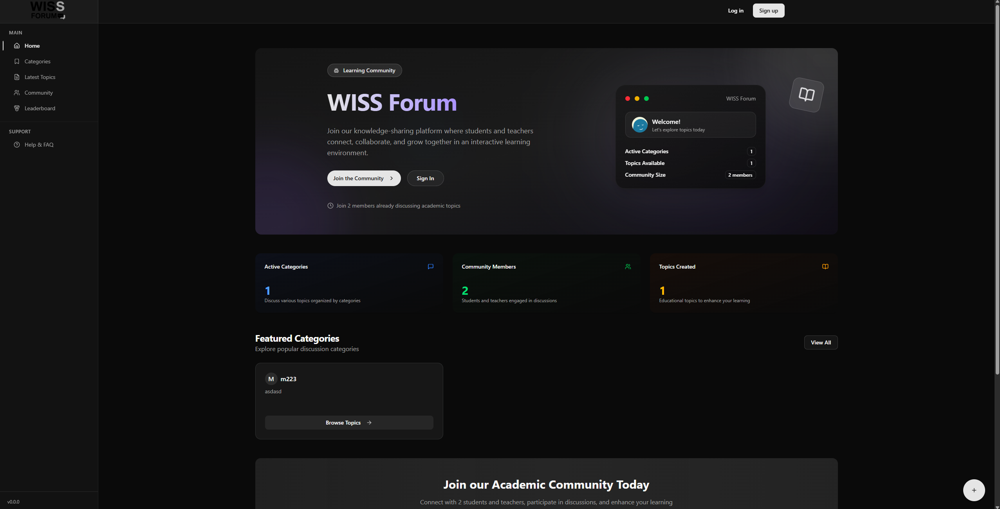

> *Startseite ohne Login.*

### 3.5 Troubleshooting

| Problem                           | Lösung                                               |
| --------------------------------- | ---------------------------------------------------- |
| "Cannot connect to Docker daemon" | Docker Desktop öffnen & Engine starten               |
| Port 3000 / 8080 bereits belegt   | killen Sie die Prozesse die den Port 3000 / 8080 benutzen (netstat -ano | findstr :3000 oder 8080 zum finden der PID und taskkill /PID <PID> /F zum killen) |
| Weisse Seite im Browser            | console logs im browser anschauen (meistens missing dependencies (wenn man den Namen findet kann man es installieren zb npm install <name>))    |
| Allgemeine MongoDB Fehler | MongoDB starten und docker container neu starten oder halt manuell starten |

---

## 4. Benutzeranleitung

### 4.1 Erste Schritte – Registrierung

> NOTE: Sie sollten wissen das `forgot password` nicht funktioniert in der `Login` Seite, da ich meine Mail konfigurationen nicht teile. Sie können es einfach ignorieren.

1. Rufen Sie [http://localhost:3000](http://localhost:3000) auf.
2. Klicken Sie **Sign Up** -> Formular ausfüllen -> **Register**.

   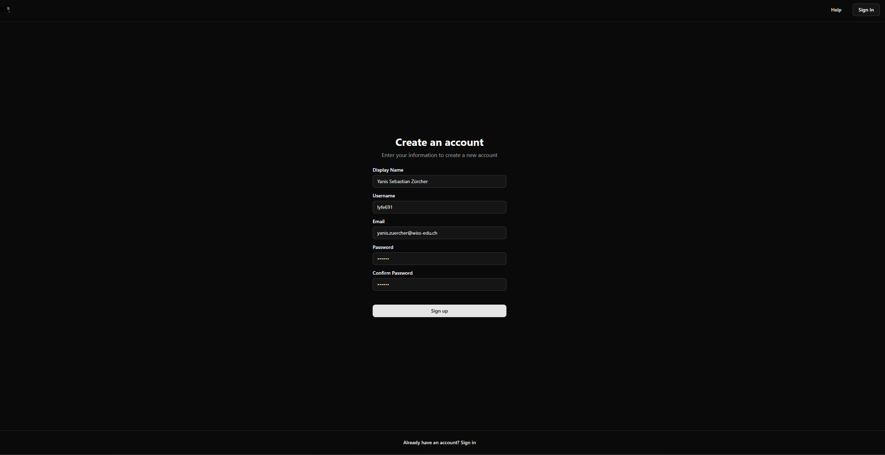

### 4.2 Sie sind eingeloggt

* Nach dem Login sehen Sie die authentifizierte sicht.

    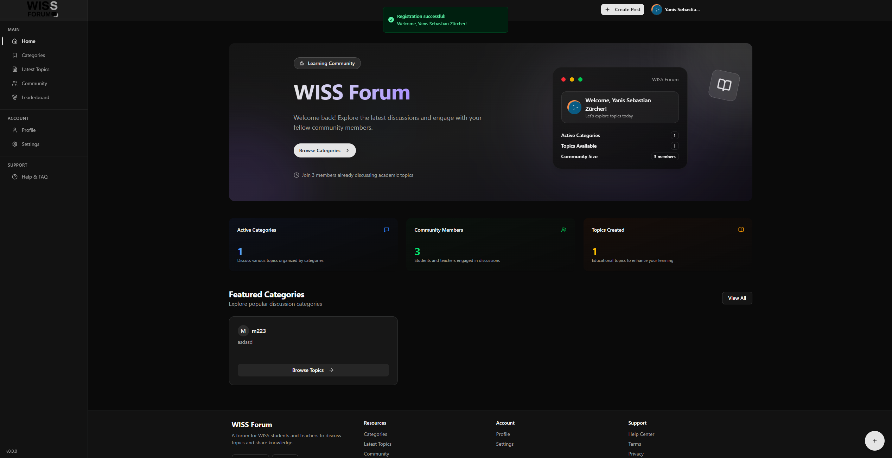

1. Klicken Sie auch das `+` unten rechts um einen neuen Beitrag zu erstellen, dann fällt Ihnen auf das es noch gar keine Kategorien gibt.
2. Sie können noch keine Beiträge erstellen da Sie die Rolle `Student` haben (nur Admins und Teachers können Kategorien erstellen). 

### 4.3 Rollen wechseln

1. Navigieren Sie zum Bootstrap Tool [http://localhost:3000/admin-tool](http://localhost:3000/admin-tool)
2. Jetzt können Sie beliebig Ihre Rolle wechseln. Der Secret Key ist aus development gründen schon eingetragen für Sie.
3. Nachdem Sie Ihre Rolle zu `Admin` oder `Teacher` geändert haben werden Sie ausgeloggt und müssen sich erneut einloggen.
4. Jetzt können Sie Kategorien erstellen.
    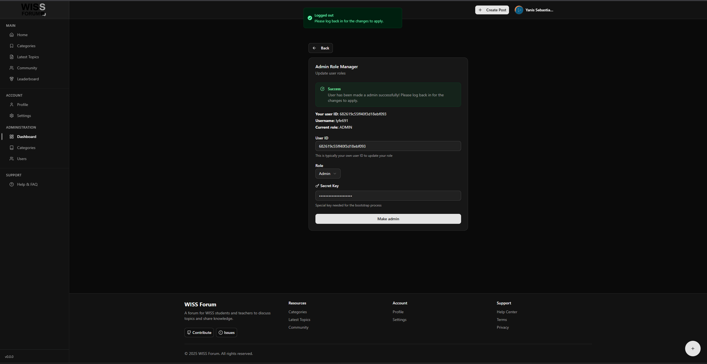
    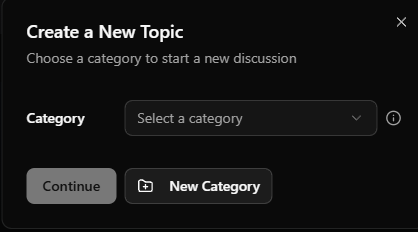


### 4.4 Kategorie & Topic erstellen

1. Kategorie erstellen, entweder per `+` unten rechts oder per `localhost:3000/admin/categories`
2. Klicken Sie auf das `+` unten rechts um einen neuen Beitrag zu erstellen.
3. Wählen Sie die Kategorie aus die Sie erstellt haben und füllen Sie das Formular aus.
4. Klicken Sie auf `Create` um den Beitrag zu erstellen.

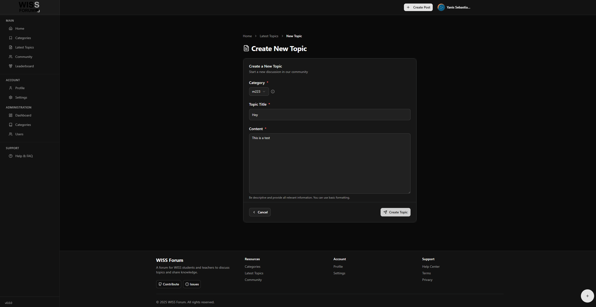
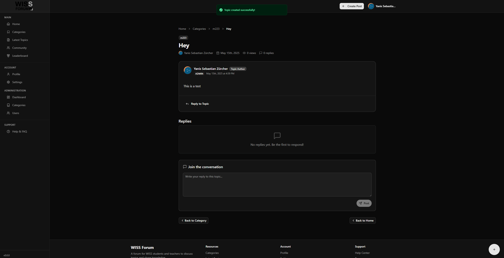

Sie können beliebig die funktionen testen, wie z.B. `reply`, `like`.
Sie können auch benutzer wechseln mit zb einer anderer rolle und einfach los diskutieren.
Ich empfehle Ihnen mal einfach ein paar Benutzer zu erstellen, zu liken und zu antworten um die Funktionen zu testen.

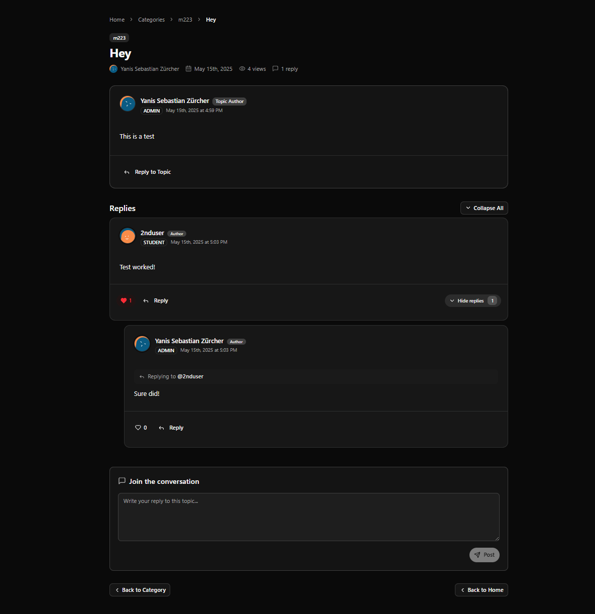

### 4.5 Profil & Einstellungen

* Display Name, Username, Email, Bio & Passwort unter **Profile** oder **Settings** anpassen.
* Theme‑Umschaltung (Light / Dark / Steam) in **Settings**.
> Profil

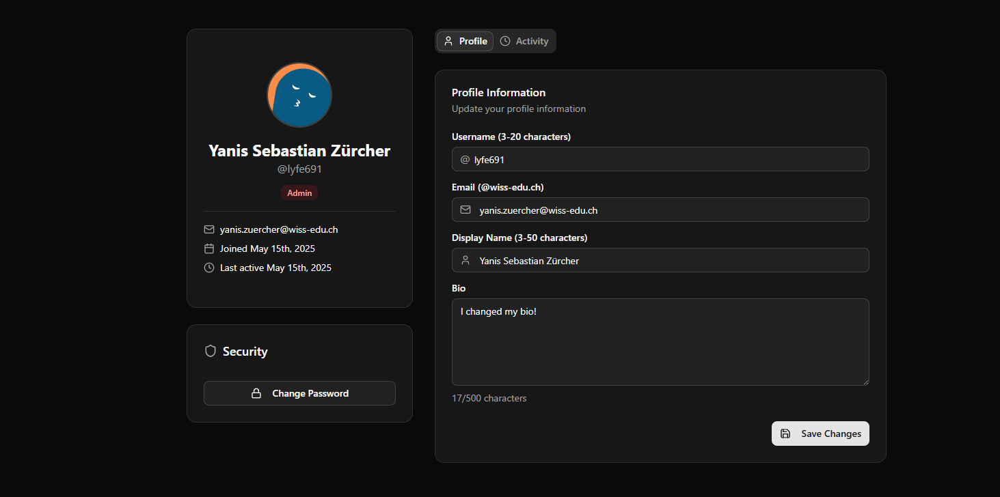

> Settings (theme)

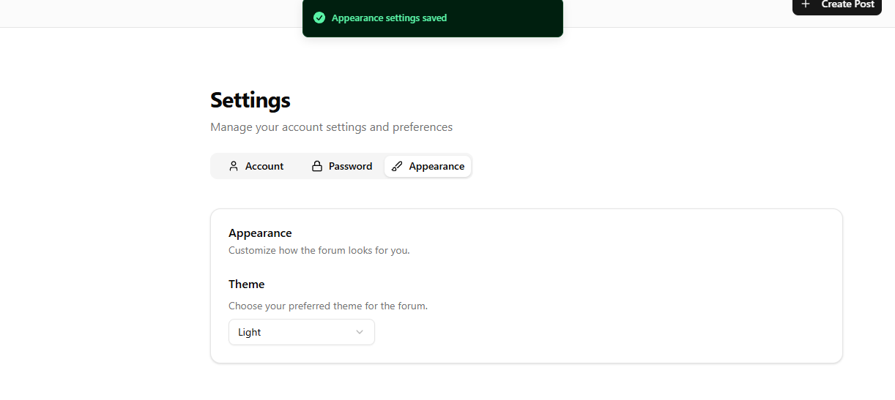

### 4.6 Leaderboard

Sie können den Leaderboard unter `localhost:3000/leaderboard` sehen.
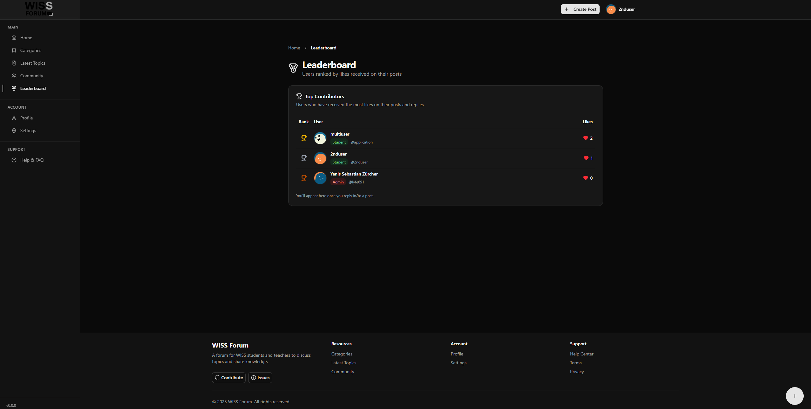

Wie Sie sehen können wird ein gamification angewendet.

### 4.7 Admin-Funktionen (Rolle Teacher)

Ein Teacher hat nur zugriff auf das category management (CRUD).

> Category Management

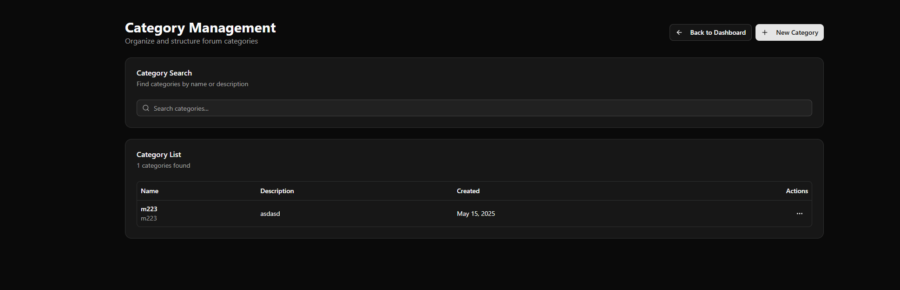
### 4.8 Admin‑Funktionen (Rolle Admin)

* **Admin Dashboard** - Benutzer‑ & Kategorien­verwaltung.
* Rollen upgraden / downgraden per Dropdown neben dem Benutzer­namen in `http://localhost:3000/admin/users`. Man kann auch Benutzer (Student, Teacher) löschen als Admin.
* Kategorien CRUD unter **Admin -> Categories** in `http://localhost:3000/admin/categories`.

> Admin Dashboard

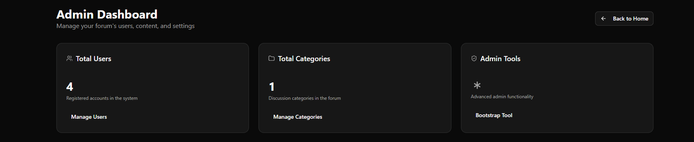

> User Management

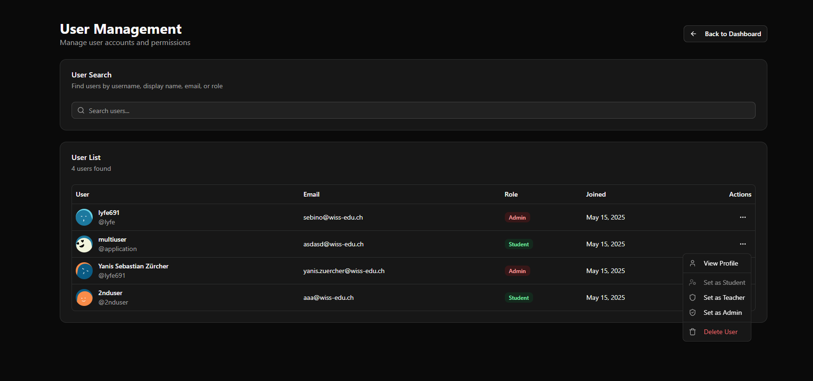

> Category Management


#### Das waren die Kernfunktionen der app, Sie können sich gerne weitere Funktionen anschauen und ausprobieren wie zb: 

* Community: `localhost:3000/community`
* View Count, Reply Count: Sehen sie zb. in `http://localhost:3000/topics/latest`
* etc.

---

## 5. Technologie‑Stack

| Ebene      | Technologie                       | Kommentar                     |
| ---------- | --------------------------------- | ----------------------------- |
| Frontend   | React 18 + TypeScript + Vite      | UI - Tailwind CSS + shadcn/ui |
| Backend    | Spring Boot, Maven                | REST API, JWT‑Auth    |
| DB         | MongoDB                           | Persistenz                    |
| Deployment | Docker Compose                    | Mehrere Container → One‑Click |

---

## 6. Architektur & Hauptkomponenten

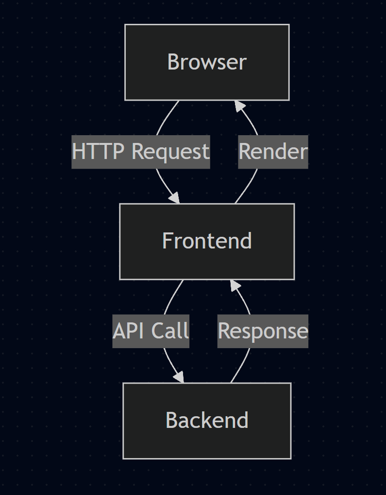

```
[ Browser ] ⇄ [ Frontend ] ⇄ REST ⇄ [ Backend ] ⇄ [MongoDB ]
```


* **AuthProvider.tsx** hält JWT‑Session im React Context.
* **ProtectedRoute.tsx** schützt Seiten & prüft Rollen.
* **AuthContext.tsx** handelt die Authentifizierung und kann einfach verwendet werden mit `useAuth()` hook.
* **roleUtils.ts** ist ein utility um die rollen zu prüfen.
* **api.ts** handlet fast all api requests.

---

## 7. Feature‑Übersicht

| **Kategorie**          | **Highlights**                                                                                   |
| ---------------------- | ------------------------------------------------------------------------------------------------ |
| **Benutzerverwaltung** | Selbstregistrierung, Rollenwechsel & Deletion über Admin-Tool, Avatare via DiceBear API                     |
| **Diskussionen**       | Kategorien, Topics, Replies, Pagination & Accepted Answers                        |
| **Gamification**       | Punktesystem basierend auf Aktivität, **Leaderboard** für Motivation & Sichtbarkeit         |
| **Sicherheit**         | Passwörter mit **BCrypt** gehasht, JWT in **HttpOnly-Cookies**, rollenbasierte Zugriffskontrolle |
| **Admin-Funktionen**   | Benutzerverwaltung, Rollen-Upgrade/Downgrade, Kategorie-Management, Statistiken                  |
| **Design & Usability** | Drei Themes (Light, Dark, Steam) – lokal gespeichert, responsive & performant                    |

---

## 8. Sicherheit & Datenschutz

* BCrypt‑Hashing für Passwörter
* JWT in **HttpOnly‑Cookies**
* Rollen‑Checks server‑ & client‑seitig (`roleUtils.tsx`)

---

## 9. Fazit / Reflexion

Das **WISS Forum** zeigt, wie moderne Webtechnologien, eine modulare Architektur und gezielte UX-Entscheidungen zu einer **skalierbaren und motivierenden Lernplattform** für Schulen kombiniert werden können. Besonders der Gamification-Ansatz hebt die Beteiligung deutlich hervor und bringt einen echten Mehrwert in der schulischen Kommunikation.

Am anfang war es relativ schwer das ganze rollen zeug zu verstehen und zu implementieren. Z.B. die verschiedenen ansicheten der Rollen, jedoch nachdem ich eine solidere rollen implementierung hatte, war es einfach alles zu verstehen und zu implementieren.

### 💡 Learnings

* **Shift‑Left Testing** spart langfristig Zeit – die späte Testphase verzögerte den MVP.
* **Rollenbasierte Features** sollten frühzeitig definiert und eingeplant werden – nachträgliche Änderungen sind aufwändig.
* **Dokumentation & Ownership** sind entscheidend – eine klare Projektverantwortung verbessert Qualität und Tempo.

---

## 10. Anhang

### 10.1 Projektquellen

* [GitHub Repository](https://github.com/lyfe691/wiss-forum/)
* Verwendete Bibliotheken und Frameworks sind in den jeweiligen package.json und pom.xml Dateien aufgeführt

### 10.2 Nutzermanagement

| Standardrolle | Berechtigungen                                         |
| ------------- | ------------------------------------------------------ |
| Student       | Lesen, Antworten, liken, Profil bearbeiten            |
| Teacher       | Kategorie-Management                         |
| Admin         | Benutzer-Management, Kategorie-Management    |

---
