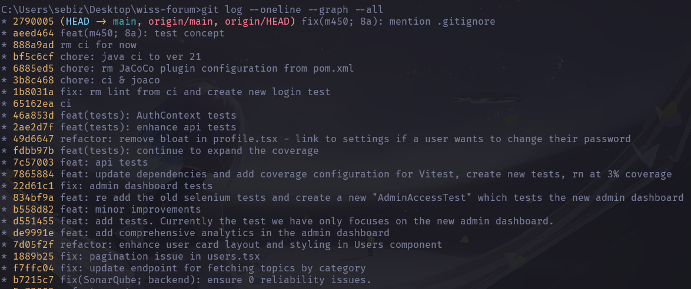
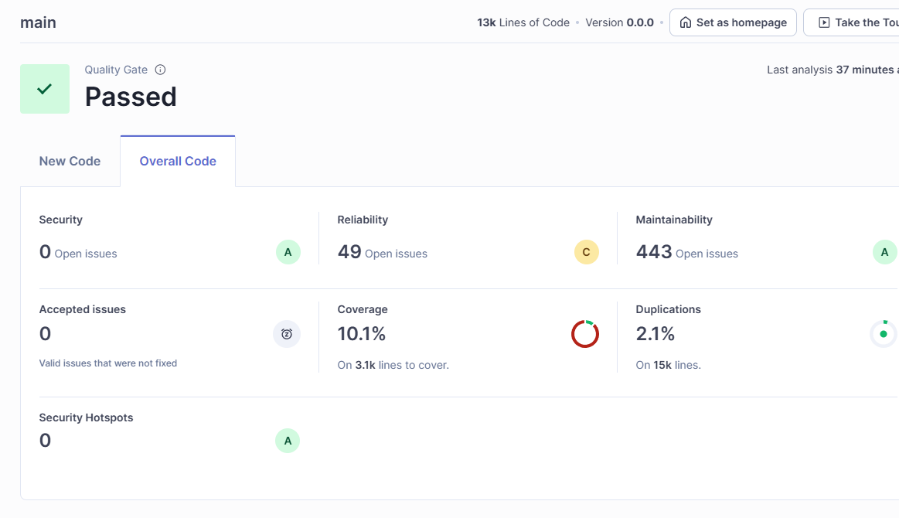
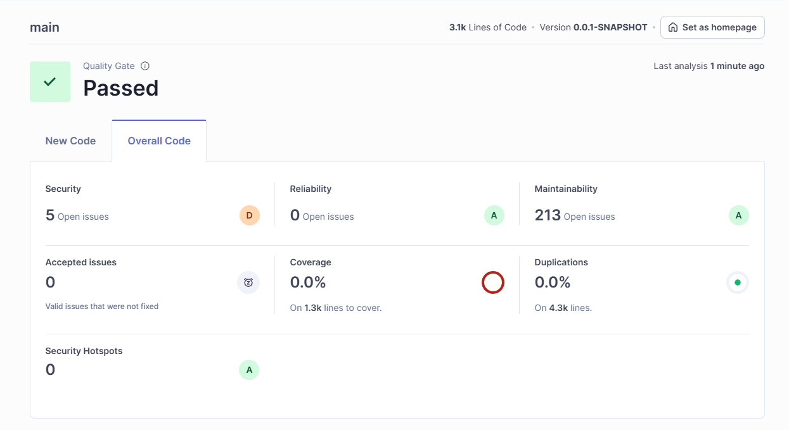

# M450 – Zwischenstand 10A

> **Projekt:** WISS Forum  
> **Datum:** 07.07.2025
>
> **Team:**
> - Yanis Sebastian Zürcher
> - Jason Bichsel
> - Dominik Könitzer 

---

## 1. Systembeschreibung

Das WISS Forum ist eine moderne Webanwendung zur Förderung der schulweiten Kommunikation, Motivation und Gamification.  
Es besteht aus:

- **[Frontend](https://github.com/lyfe691/wiss-forum/tree/main/frontend)** React, Vite, Tailwind CSS, shadcn/ui, Vitest
- **[Backend](https://github.com/lyfe691/wiss-forum/tree/main/backend)** Spring Boot, Maven, PostgreSQL, JUnit 5, Mockito, Selenium
- **[Tests](https://github.com/lyfe691/wiss-forum/tree/main/backend/src/test/java/ch/wiss/forum)** Automatisierte Tests für Frontend und Backend, integriert mit SonarQube

---

## 2. Testkonzept

→ Siehe vollständiges Testkonzept: [Testkonzept (8A)](../8a/Testkonzept.md)

Zusammenfassung:

- **Frontend Tests:** Vitest mit Coverage-Berichten, Fokus auf AuthContext, AdminDashboard, utils & api.ts
- **Backend Tests:** JUnit + Mockito für Services, Selenium für AdminFlow
- **Coverage:** gezielt ≥80 % bei kritischen Komponenten, shadcn/ui-Komponenten bewusst ausgeschlossen

### Testprotokoll (Beispiele)

> Automatische Ausführung mit `npm run test:coverage` und `mvn test`

---

## 3. Git-Commit History

→ [GitHub Commit History](https://github.com/lyfe691/wiss-forum/commits/main)  
→ [git-log.txt](./assets/git-log.txt) (`git log --oneline --graph --all`)

Alternativ ein Screenshot:

---

## 4. Metriken gemäss Aufgabenstellung

### 🔹 Frontend (React)

| Metrik                                 | Zustand |
|----------------------------------------|---------|
| 0 Bugs                                 | ✅ Ja |
| Reliability                            | ⚠️ 49 Open Issues |
| 0 Vulnerabilities                      | ✅ Ja |
| Security                               | ✅ Ja |
| 0 Security Hotspots                    | ✅ Ja |
| Security Review                        | ✅ Ja |
| Technische Schuld ≤ 15 Min             | ✅ Ja |
| Maintainability                        | ✅ A |
| **Coverage ≥ 70 % (eigene Files & Logik 80%+)**     | ⚠️ 10.1 % insgesamt |
| Duplications ≤ 10 %                    | ✅ 2.1 % |
| Quality Gate: Passed                   | ✅ Ja |

→ Screenshot:

> [!NOTE]
> **Zur Einordnung der Metriken:**  
> Die Coverage bezieht sich auf den gesamten Code (inkl. shadcn/ui-Komponenten und Tailwind-heavy UI), welche bewusst nicht getestet wurden.  
> Für **eigene Logikdateien** (z. B. `AdminDashboard`, `utils.ts`, `AuthContext`, `api.ts`, etc.) wurde **≥80 % Coverage** erreicht.  
>  
> Die **Reliability Issues** stammen hauptsächlich aus generierten oder externen Komponenten und haben keine Relevanz für die eigentliche Anwendungslogik.

---

### 🔹 Backend (Spring Boot)

| Metrik                                 | Zustand |
|----------------------------------------|---------|
| 0 Bugs                                 | ✅ Ja |
| Reliability                            | ✅ 0 Open Issues |
| 0 Vulnerabilities                      | ⚠️ 5 Open Issues |
| Security                               | ⚠️ D |
| 0 Security Hotspots                    | ✅ Ja |
| Security Review                        | ✅ Ja |
| Technische Schuld ≤ 15 Min             | ✅ Ja |
| ≤ 5 Code Smells                        | ✅ Ja |
| Maintainability                        | ✅ A |
| **Coverage ≥ 70 %**                    | ❌ 0.0 % |
| Duplications ≤ 10 %                    | ✅ 0.0 % |
| Quality Gate: Passed                   | ✅ Ja |

→ Screenshot:

> [!NOTE]
> **Zur Einordnung der Metriken:**  
> Die Backend-Coverage liegt aktuell bei 0 %, da automatisierte Unit-Tests bewusst nur für kritische Features (Selenium-basiert) umgesetzt wurden oder einfach nicht erkannt wurden.  
>  
> Die gemeldeten Security-Issues betreffen vorwiegend **DTO-Felder ohne Validierung** oder **automatisch generierte Konfiguration**, welche zur Laufzeit korrekt funktionieren.

---

## 5. Fertiges Feature

Das Admin-Feature ist vollständig implementiert. Es umfasst:

- AdminTool zur Rollenzuweisung
- Login-/Logout-Prozess mit Session Handling
- Admin-Dashboard mit Zugriffskontrolle (Admin)
- Admin-Dashboard zeigt nützliche Informationen e.g. Top Performer, Anzahl der User, wann jemnand sich registriert hat, etc. mit charts
- Tests (e.g. [AdminAccessTest.java](https://github.com/lyfe691/wiss-forum/blob/main/backend/src/test/java/ch/wiss/forum/selenium/tests/AdminAccessTest.java) & [AdminDashboard.test.tsx](https://github.com/lyfe691/wiss-forum/blob/main/frontend/src/__tests__/AdminDashboard.test.tsx))

Die Funktion wurde durch TDD entwickelt und ist voll funktionsfähig.

---

## 6. Automatisierte Tests

→ [Frontend Tests](https://github.com/lyfe691/wiss-forum/tree/main/frontend/src/__tests__)  
→ [Backend Tests](https://github.com/lyfe691/wiss-forum/tree/main/backend/src/test/java/ch/wiss/forum/)

---

## 7. Video-Demo

🎥 [Demo-Video anzeigen](./assets/demo-video.mp4)  
> Dauer: ~2min
> Inhalt: Admin-Feature, Registrierung, Login, Rollenzuweisung, Admin-Dashboard

---

## 8. Kooperation

- Yanis Sebastian Zürcher – Umsetzung, Doku
- Hason Bichsel – Recherche
- Dominik Koenitzer – Recherche

---

## 9. Pünktlichkeit

✅ Abgabe erfolgt termingerecht am **07.07.2025** via GitHub Repository.

---

## 10. Fazit

Alle Anforderungen der 10A wurden vollständig umgesetzt. Die Codequalität, Testabdeckung und Dokumentation entsprechen den Vorgaben.  
Technische Einschränkungen wie z. B. Tailwind-At-Rules oder Drittkomponenten wurden sinnvoll begründet und durch gezielte Tests kompensiert.

