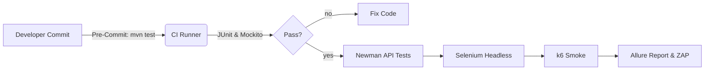

# SideQuest 2A – Wahl & Integration der Testumgebung für das **WISS Forum**

**Team:**
- Yanis Sebastian Zürcher
- Jason Bichsel
- Dominik Könitzer

**Datum:** 15.06.2025
**Version:** 0.2
---

## Inhaltsverzeichnis

1. [Einleitung](#0--einleitung)
2. [Nicht‑funktionale Anforderungen (NFA)](#1--nicht-funktionale-anforderungen-nfa)
3. [Gewählte Testumgebung](#2--gewählte-testumgebung)

   1. [Hardware / Infrastruktur](#21--hardware--infrastruktur)
   2. [Betriebssysteme & Browser](#22--betriebssysteme--browser)
   3. [Frameworks & Tools](#23--frameworks--tools-mit-version)
4. [Anpassungen am Testkonzept](#3--anpassungen-am-testkonzept)

   1. [Automatisierbare Testziele](#31--automatisierbare-testziele)
   2. [Nicht-abdeckbare Tests](#32--nicht-abdeckbare-tests)
   3. [Mittel & Verfahren](#33--mittel--verfahren)
   4. [Zusätzliche Testmöglichkeiten](#34--zusätzliche-testmöglichkeiten)
   5. [Auswirkung auf Testdaten & Unterlagen](#35--auswirkung-auf-testdaten--unterlagen)
   6. [Testverantwortlichkeiten & Zeitpunkte](#36--testverantwortlichkeiten--zeitpunkte)
   7. [Reporting‑Anpassungen](#37--reporting-anpassungen)
   8. [Wiederholbarkeit & Nachvollziehbarkeit](#38--wiederholbarkeit--nachvollziehbarkeit)
   9. [Defect‑Handling‑Workflow](#39--defect-handling-workflow)
5. [Fazit](#4--fazit)
6. [Referenzen](#5--referenzen)

---

## 0. Einleitung

Diese Dokumentation erweitert das bestehende Testkonzept (**Version 0.1**) des Projekts **WISS Forum** um die im SideQuest 2A geforderten Punkte: begründete Wahl einer Testumgebung sowie die daraus resultierenden Anpassungen an Prozessen, Daten und Verantwortlichkeiten.

---

## 1.  Nicht‑funktionale Anforderungen (NFA)

| ID     | Kategorie      | Anforderung                                                        |
| ------ | -------------- | ------------------------------------------------------------------ |
| NFA‑01 | Performance    | 90 % aller API‑Aufrufe antworten < 1 s                             |
| NFA‑02 | Skalierbarkeit | ≥ 200 gleichzeitige Benutzer ohne Funktionsverlust                 |
| NFA‑03 | Usability      | WCAG 2.1 AA werden eingehalten                                     |
| NFA‑04 | Sicherheit     | Vermeidung aller OWASP‑Top‑10‑Risiken                              |
| NFA‑05 | Wartbarkeit    | CI‑Pipeline führt komplette Test­su­ite bei jedem Pull‑Request aus |

Diese Anforderungen diktieren eine Umgebung, die **automatisierte API‑, Last‑, UI‑ und Sicherheitstests** ermöglicht.

---

## 2. Gewählte Testumgebung

### 2.1. Hardware / Infrastruktur

* Entwickler‑Workstations ≥ 16 GB RAM, Docker Desktop (WSL 2)
* CI‑Runner · **GitHub Actions** (Ubuntu 22.04 `ubuntu‑latest`)

### 2.2. Betriebssysteme & Browser

| Ebene   | Version                             |
| ------- | ----------------------------------- |
| Windows | 10 / 11 (+ WSL Ubuntu 22.04)        |
| Ubuntu  | 22.04 LTS                           |
| Browser | Chrome 126 · Firefox 127 · Edge 125 |

### 2.3. Frameworks & Tools (mit Version)

| Zweck              | Tool               | Version | Begründung                            |
| ------------------ | ------------------ | ------- | ------------------------------------- |
| Unit & Integration | **JUnit 5**        | 5.11    | De‑facto‑Standard, Spring‑Integration |
| Mocking            | Mockito            | 5.10    | Isolierte Logiktests                  |
| DB‑Isolation       | Testcontainers     | 3.0     | Ephemere MongoDB‑Instanzen            |
| API‑Tests          | Postman / Newman   | 10.23   | Schnelle CLI‑Regression               |
| UI‑Tests           | Selenium WebDriver | 4.19    | Browser‑Automation                    |
| Last‑& Stresstests | k6                 | 0.51    | Skript‑basierte Load‑Tests            |
| Performance‑Audit  | Lighthouse CI      | 11.0    | LCP / CLS / TTI‑Analyse               |
| Security‑Scan      | OWASP ZAP          | 2.14    | Automatische Schwachstellenprüfung    |
| Reporting          | Allure Report      | 2.24    | Zentrale Ergebnisausgabe              |

> **IDE‑Setup**
> *IntelliJ IDEA* für Spring Boot (Backend)
> *VS Code* für React + TypeScript (Frontend)

---

## 3. Anpassungen am Testkonzept

### 3.1. Automatisierbare Testziele

| Testziel                          | Automatisierbar? | Mittel                                      |
| --------------------------------- | ---------------- | ------------------------------------------- |
| i. Fehler identifizieren          | ✅                | JUnit 5, Mockito, Testcontainers            |
| ii. Leistung überprüfen           | ✅                | k6, Lighthouse CI                           |
| iii. Benutzerakzeptanz nachweisen | ◻️ teilweise     | Selenium (End‑to‑End) + manuelle Beta‑Tests |

### 3.2. Nicht‑abdeckbare Tests

* **Barrierefreiheit (Screenreader, Keyboard‑Only)** → manuell
* **Mobile Swipe‑Gesten** → Appium oder manuell

### 3.3. Mittel & Verfahren

* **Lokale Entwickler**: IntelliJ‑Test‑Runner, Selenium IDE Record/Playback.
* **CI**: Skripte in `./.github/workflows/tests.yml`.

### 3.4. Zusätzliche Testmöglichkeiten

* **OWASP ZAP‑Scan** pro Pull‑Request (automatisiert)
* **Lighthouse Budget Check** zur Performance‑Regression

### 3.5. Auswirkung auf Testdaten & Unterlagen

* **Testcontainers** liefern frische DB‑Instanzen -> keine persistenten Dummies nötig.
* Fixtures liegen in `/tests/fixtures/*.json`.

### 3.6. Testverantwortlichkeiten & Zeitpunkte

| Phase        | Verantwortlich | Zeitpunkt     |
| ------------ | -------------- | ------------- |
| Pre‑Commit   | Entwickler     | lokal         |
| Pull‑Request | CI Runner      | automatisch   |
| Nightly      | QA             | 02:00 UTC    |

### 3.7. Reporting‑Anpassungen

* **Allure HTML** wird pro CI‑Run publiziert.
* Fehlertickets werden via GitHub‑Action in Jira angelegt.

### 3.8. Wiederholbarkeit & Nachvollziehbarkeit

* `docker‑compose test‑stack.yml` erzeugt identische Umgebung.
* Test‑Artefakte & Berichte werden 90 Tage archiviert.

### 3.9. Defect‑Handling‑Workflow

1. CI Pipeline schlägt fehl -> Merge blockiert
2. Automatisches Jira‑Ticket inkl. Allure‑Link
3. Entwickler fixt -> neuer Pull‑Request -> Pipeline wiederholt sich

---

## 4. Fazit

Die ausgewählte Testumgebung deckt sämtliche kritischen NFAs ab, erlaubt einen hohen Grad an Automatisierung und integriert sich nahtlos in die bestehende GitHub‑Workflow‑Landschaft. Nicht automatisierbare Tests (A11y, Mobile Gesten) sind sauber ausgewiesen und werden manuell durchgeführt.

---

## 5. Referenzen

* Spring Boot 3.4.5 – [https://spring.io/projects/spring-boot](https://spring.io/projects/spring-boot)
* k6 Docs – [https://k6.io/docs](https://k6.io/docs)
* Selenium HQ – [https://www.selenium.dev](https://www.selenium.dev)
* OWASP ZAP – [https://owasp.org/www-project-zap/](https://owasp.org/www-project-zap/)
