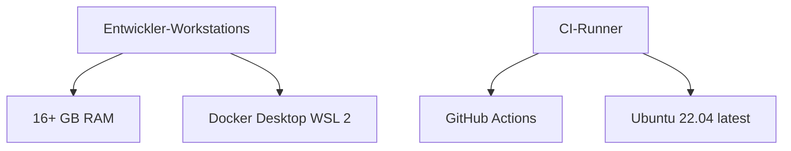
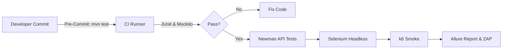
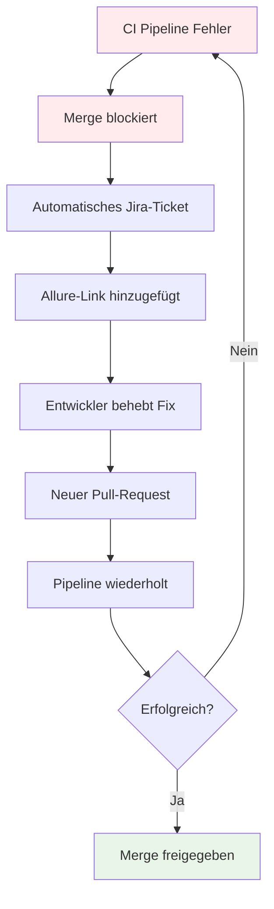

# SideQuest 2A – Wahl & Integration der Testumgebung für das **WISS Forum**


## Team

| Name | Rolle |
|------|-------|
| **Yanis Sebastian Zürcher** | Doku|
| **Jason Bichsel** | Recherche|
| **Dominik Könitzer** | Recherche |

---

## Inhaltsverzeichnis

- [Einleitung](#einleitung)
- [Nicht‑funktionale Anforderungen (NFA)](#nicht-funktionale-anforderungen-nfa)
- [Gewählte Testumgebung](#gewählte-testumgebung)
  - [Hardware / Infrastruktur](#hardware--infrastruktur)
  - [Betriebssysteme & Browser](#betriebssysteme--browser)
  - [Frameworks & Tools](#frameworks--tools-mit-version)
- [Anpassungen am Testkonzept](#anpassungen-am-testkonzept)
  - [Automatisierbare Testziele](#automatisierbare-testziele)
  - [Nicht-abdeckbare Tests](#nicht-abdeckbare-tests)
  - [Mittel & Verfahren](#mittel--verfahren)
  - [Zusätzliche Testmöglichkeiten](#zusätzliche-testmöglichkeiten)
  - [Auswirkung auf Testdaten & Unterlagen](#auswirkung-auf-testdaten--unterlagen)
  - [Testverantwortlichkeiten & Zeitpunkte](#testverantwortlichkeiten--zeitpunkte)
  - [Reporting‑Anpassungen](#reporting-anpassungen)
  - [Wiederholbarkeit & Nachvollziehbarkeit](#wiederholbarkeit--nachvollziehbarkeit)
  - [Defect‑Handling‑Workflow](#defect-handling-workflow)
- [Fazit](#fazit)
- [Referenzen](#referenzen)

---

## Einleitung

> [!NOTE]
> Diese Dokumentation erweitert das bestehende **Testkonzept (Version 0.1)** des Projekts **WISS Forum** um die im SideQuest 2A geforderten Punkte: begründete Wahl einer Testumgebung sowie die daraus resultierenden Anpassungen an Prozessen, Daten und Verantwortlichkeiten.

---

## Nicht‑funktionale Anforderungen (NFA)


<strong>Übersicht der NFA-Kategorien</strong>

| ID | Kategorie | Anforderung | Zielwert |
|-------|--------------|----------------|-------------|
| **NFA‑01** | **Performance** | API‑Antwortzeiten | `< 1s` für 90% aller Aufrufe |
| **NFA‑02** | **Skalierbarkeit** | Gleichzeitige Benutzer | `≥ 200` ohne Funktionsverlust |
| **NFA‑03** | **Usability** | Barrierefreiheit | WCAG 2.1 AA Konformität |
| **NFA‑04** | **Sicherheit** | Schwachstellenschutz | Alle OWASP‑Top‑10‑Risiken vermeiden |
| **NFA‑05** | **Wartbarkeit** | CI‑Integration | Vollständige Testsuite bei jedem PR |


> [!IMPORTANT]
> Diese Anforderungen diktieren eine Umgebung, die **automatisierte API‑, Last‑, UI‑ und Sicherheitstests** ermöglicht.

---

## Gewählte Testumgebung

### Hardware / Infrastruktur



| Komponente | Spezifikation |
|------------|---------------|
| **Entwickler-Workstations** | ≥ 16 GB RAM, Docker Desktop (WSL 2) |
| **CI-Runner** | GitHub Actions (Ubuntu 22.04 `ubuntu‑latest`) |

### Betriebssysteme & Browser


| Ebene | Version | Status |
|----------|------------|-----------|
| **Windows** | 10 / 11 (+ WSL Ubuntu 22.04) | Primär |
| **Ubuntu** | 22.04 LTS | CI/CD |
| **Browser** | Chrome 126 · Firefox 127 · Edge 125 | Cross-Browser |


### Frameworks & Tools (mit Version)

<strong>Vollständige Tool-Übersicht</strong>

| Zweck | Tool | Version | Begründung |
|----------|----------|------------|---------------|
| **Unit & Integration** |  | `5.11` | De‑facto‑Standard, Spring‑Integration |
| **Mocking** |  | `5.10` | Isolierte Logiktests |
| **DB‑Isolation** |  | `3.0` | Ephemere MongoDB‑Instanzen |
| **API‑Tests** |  | `10.23` | Schnelle CLI‑Regression |
| **UI‑Tests** |  | `4.19` | Browser‑Automation |
| **Last‑& Stresstests** |  | `0.51` | Skript‑basierte Load‑Tests |
| **Performance‑Audit** |  | `11.0` | LCP / CLS / TTI‑Analyse |
| **Security‑Scan** |  | `2.14` | Automatische Schwachstellenprüfung |
| **Reporting** |  | `2.24` | Zentrale Ergebnisausgabe |


> [!TIP]
> **IDE‑Setup**
> - **IntelliJ IDEA** für Spring Boot (Backend)
> - **VS Code** für React + TypeScript (Frontend)

---

## Anpassungen am Testkonzept

### Automatisierbare Testziele

| Testziel | Automatisierbar? | Mittel |
|-------------|---------------------|-----------|
| **Fehler identifizieren** | **Vollständig** | JUnit 5, Mockito, Testcontainers |
| **Leistung überprüfen** | **Vollständig** | k6, Lighthouse CI |
| **Benutzerakzeptanz nachweisen** | **Teilweise** | Selenium (E2E) + manuelle Beta‑Tests |

### Nicht-abdeckbare Tests

> [!WARNING]
> **Manuelle Tests erforderlich:**
> - **Barrierefreiheit** (Screenreader, Keyboard‑Only) → Manuell
> - **Mobile Swipe‑Gesten** → Appium oder manuell

### Mittel & Verfahren



**Entwicklungsumgebungen:**
- **Lokale Entwickler:** IntelliJ‑Test‑Runner, Selenium IDE Record/Playback
- **CI:** Skripte in `./.github/workflows/tests.yml`

### Zusätzliche Testmöglichkeiten

> [!NOTE]
> **Erweiterte Testfunktionen:**
> - **OWASP ZAP‑Scan** pro Pull‑Request (automatisiert)
> - **Lighthouse Budget Check** zur Performance‑Regression

### Auswirkung auf Testdaten & Unterlagen

- **Testcontainers** liefern frische DB‑Instanzen → keine persistenten Dummies nötig
- **Fixtures** liegen in `/tests/fixtures/*.json`

### Testverantwortlichkeiten & Zeitpunkte

| Phase | Verantwortlich | Zeitpunkt | Status |
|----------|-------------------|-------------|-----------|
| **Pre‑Commit** | Entwickler | Lokal |  |
| **Pull‑Request** | CI Runner | Automatisch |  |
| **Nightly** | QA Team | 02:00 UTC |  |

### Reporting‑Anpassungen

- **Allure HTML** wird pro CI‑Run publiziert
- **Fehlertickets** werden via GitHub‑Action in Jira angelegt

### Wiederholbarkeit & Nachvollziehbarkeit

```yaml
# docker‑compose test‑stack.yml
version: '3.8'
services:
  test-environment:
    image: "wiss-forum:test"
    environment:
      - ENV=test
    volumes:
      - ./test-data:/data
```

- `docker‑compose test‑stack.yml` erzeugt identische Umgebung
- Test‑Artefakte & Berichte werden **90 Tage** archiviert

### Defect‑Handling‑Workflow

<strong>Workflow-Details</strong>



1. **CI Pipeline schlägt fehl** → Merge blockiert
2. **Automatisches Jira‑Ticket** inkl. Allure‑Link
3. **Entwickler fixt** → neuer Pull‑Request → Pipeline wiederholt sich


---

## Fazit

> [!SUCCESS]
> Die ausgewählte Testumgebung deckt sämtliche kritischen **NFAs** ab, erlaubt einen hohen Grad an **Automatisierung** und integriert sich nahtlos in die bestehende **GitHub‑Workflow‑Landschaft**. 
> 
> Nicht automatisierbare Tests (A11y, Mobile Gesten) sind sauber ausgewiesen und werden **manuell durchgeführt**.


| Metriken | Zielwert | Status |
|-------------|-------------|-----------|
| **Automatisierungsgrad** | > 80% |  |
| **CI/CD Integration** | 100% |  |
| **Tool Coverage** | Alle NFAs |  |


---

## Referenzen


| Tool | Dokumentation | Version |
|----------|-------------------|------------|
|  | [spring.io/projects](https://spring.io/projects/spring-boot) | `3.4.5` |
|  | [k6.io/docs](https://k6.io/docs) | `0.51` |
|  | [selenium.dev](https://www.selenium.dev) | `4.19` |
|  | [owasp.org](https://owasp.org/) | `2.14` |


---