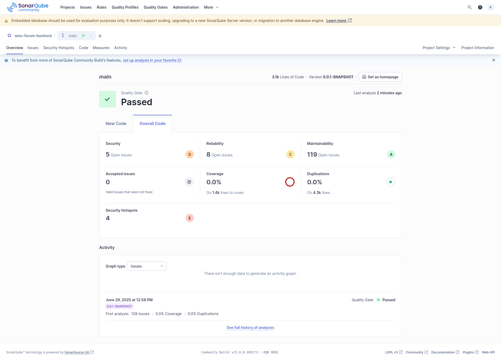

You're right — here's the updated `Dokumentation.md` with the image for the backend section **embedded cleanly**, and following the requested structure:

---

# SideQuest 6C – SonarQube Analyse

> **Datum:** 29.06.2025
> **Projekt:** WISS Forum
> **Analysearten:** Statische Codeanalyse für Backend und Frontend
>
> **Teammitglieder & Beiträge**: 
>   - Yanis Sebastian Zürcher: Doku & Umsetzung
>   - Hason Bichsel: Recherche
>   - Dominik Koenitzer: Recherche

---

## Backend: wiss-forum/backend

### Ziel

Für das Backend wurde eine vollständige statische Codeanalyse durchgeführt. Ziel war die Bewertung der Codequalität, Wartbarkeit, Sicherheit und potenzieller Redundanzen. Dies unterstützt die kontinuierliche Verbesserung des Codes und die frühzeitige Erkennung von Schwachstellen.

---

### Durchführung

Die Analyse erfolgte lokal mittels Maven und SonarQube über folgenden Befehl:

```bash
mvn clean verify sonar:sonar \
  -Dsonar.projectKey=wiss-forum-backend \
  -Dsonar.projectName='wiss-forum-backend' \
  -Dsonar.host.url=http://localhost:9000 \
  -Dsonar.token=<TOKEN> # e.g. sqp_b8f79fcc...
```

Da ich die SonarQube analyse auf der Kali VM gemacht habe und nicht auf Windows gab es ein Chrome Driver version missmatch bei der Ausführung der Selenium Tests und habe daher einfach die zuvor erstellten Selenium Tests gelöscht -- nur temporär.


---

### Ergebnisse



| Kategorie             | Ergebnis              | Bewertung             |
| --------------------- | --------------------- | --------------------- |
| **Quality Gate**      | ✅ Passed              | Anforderungen erfüllt |
| **Sicherheit**        | 5 offene Issues       | 🟠 Verbesserung nötig |
| **Security Hotspots** | 4 erkannt             | 🔴 Kritisch           |
| **Zuverlässigkeit**   | 8 offene Issues       | 🟡 Beobachten         |
| **Wartbarkeit**       | 119 offene Issues     | 🟢 Gut strukturiert   |
| **Testabdeckung**     | 0.0 % auf 1.4k Zeilen | 🔴 Keine Coverage     |
| **Duplikate**         | 0.0 % auf 4.3k Zeilen | 🟢 Keine Duplikate    |

---

### Fazit

Das Backend hat die SonarQube-Prüfung erfolgreich bestanden. Besonders positiv hervorzuheben sind die gute Wartbarkeit des Codes sowie das vollständige Fehlen von Duplikaten.

Verbesserungspotenzial besteht insbesondere bei der Testabdeckung und den identifizierten sicherheitsrelevanten Hotspots. Viele dieser Findings entstanden jedoch bewusst im Rahmen der Entwicklungsphase -- etwa durch hardcodierte IP-Adressen oder das temporäre Deaktivieren von CSRF-Schutzmechanismen.

Diese Konfigurationen sind mir bekannt und werden beim Übergang in die produktive Umgebung entsprechend angepasst und abgesichert.

**Empfehlungen:**

* **Unit- und Integrationstests mit JaCoCo hinzufügen**
* **Security Hotspots gezielt evaluieren und beheben**
* **SonarQube in den Entwicklungsprozess integrieren**

---

## Frontend: wiss-forum/frontend

*offen*

---
