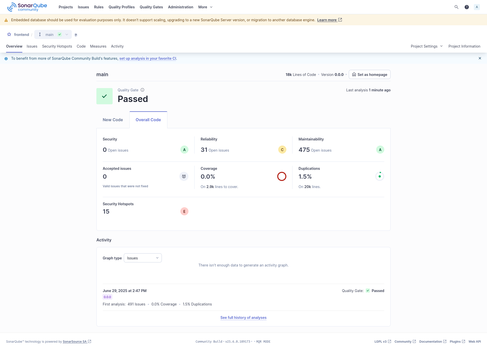

# SideQuest 6C – SonarQube Analyse

> **Datum:** 29.06.2025
> **Projekt:** WISS Forum
> **Analysearten:** Statische Codeanalyse für Backend und Frontend
>
> **Teammitglieder & Beiträge**: 
>   - Yanis Sebastian Zürcher: Doku & Umsetzung
>   - Hason Bichsel: Recherche
>   - Dominik Koenitzer: Recherche

---

## Backend: wiss-forum/backend

### Ziel

Für das Backend wurde eine vollständige statische Codeanalyse durchgeführt. Ziel war die Bewertung der Codequalität, Wartbarkeit, Sicherheit und potenzieller Redundanzen. Dies unterstützt die kontinuierliche Verbesserung des Codes und die frühzeitige Erkennung von Schwachstellen.

---

### Durchführung

Die Analyse erfolgte lokal mittels Maven und SonarQube über folgenden Befehl:

```bash
mvn clean verify sonar:sonar \
  -Dsonar.projectKey=wiss-forum-backend \
  -Dsonar.projectName='wiss-forum-backend' \
  -Dsonar.host.url=http://localhost:9000 \
  -Dsonar.token=<TOKEN> # e.g. sqp_b8f79fcc...
```

Da ich die SonarQube analyse auf der Kali VM gemacht habe und nicht auf Windows gab es ein Chrome Driver version missmatch bei der Ausführung der Selenium Tests und habe daher einfach die zuvor erstellten Selenium Tests gelöscht -- nur temporär.


---

### Ergebnisse


| Kategorie             | Ergebnis              | Bewertung             |
| --------------------- | --------------------- | --------------------- |
| **Quality Gate**      | ✅ Passed              | Anforderungen erfüllt |
| **Sicherheit**        | 5 offene Issues       | 🟠 Verbesserung nötig |
| **Security Hotspots** | 4 erkannt             | 🔴 Kritisch           |
| **Zuverlässigkeit**   | 8 offene Issues       | 🟡 Beobachten         |
| **Wartbarkeit**       | 119 offene Issues     | 🟢 Gut strukturiert   |
| **Testabdeckung**     | 0.0 % auf 1.4k Zeilen | 🔴 Keine Coverage     |
| **Duplikate**         | 0.0 % auf 4.3k Zeilen | 🟢 Keine Duplikate    |

---

### Fazit

Das Backend hat die SonarQube-Prüfung erfolgreich bestanden. Besonders positiv hervorzuheben sind die gute Wartbarkeit des Codes sowie das vollständige Fehlen von Duplikaten.

Verbesserungspotenzial besteht insbesondere bei der Testabdeckung und den identifizierten sicherheitsrelevanten Hotspots. Viele dieser Findings entstanden jedoch bewusst im Rahmen der Entwicklungsphase -- etwa durch hardcodierte IP-Adressen oder das temporäre Deaktivieren von CSRF-Schutzmechanismen.

Diese Konfigurationen sind mir bekannt und werden beim Übergang in die produktive Umgebung entsprechend angepasst und abgesichert.

**Empfehlungen:**

* **Unit- und Integrationstests mit JaCoCo hinzufügen**
* **Security Hotspots gezielt evaluieren und beheben**
* **SonarQube in den Entwicklungsprozess integrieren**

---

## Frontend: wiss-forum/frontend

### Ziel

Auch für das Frontend wurde eine statische Codeanalyse mit SonarQube durchgeführt. Ziel war es, potenzielle Schwachstellen im React/TypeScript-Code frühzeitig zu identifizieren und die allgemeine Codequalität objektiv zu bewerten.

---

### Durchführung

Da es sich beim Frontend um ein reines Node.js-/Vite-/React-Projekt handelt, wurde die Analyse mit dem offiziellen SonarScanner CLI durchgeführt. Die Installation und der Befehl erfolgten wie folgt:

#### Installation

```bash
sudo npm install -g @sonar/scan
```

#### Ausführung
```bash
sonar \
  -Dsonar.host.url=http://localhost:9000 \
  -Dsonar.token=<TOKEN> \ # e.g. sqp_ff7e5ed...
  -Dsonar.projectKey=wiss-forum-frontend
```

### Ergebnisse



| Kategorie             | Ergebnis              | Bewertung              |
| --------------------- | --------------------- | ---------------------- |
| **Quality Gate**      | ✅ Passed              | Anforderungen erfüllt  |
| **Sicherheit**        | 0 offene Issues       | 🟢 Unkritisch          |
| **Security Hotspots** | 15 erkannt            | 🔴 Kritisch            |
| **Zuverlässigkeit**   | 31 offene Issues      | 🟡 Beobachten          |
| **Wartbarkeit**       | 475 offene Issues     | 🟡 Verbesserung nötig  |
| **Testabdeckung**     | 0.0 % auf 2.9k Zeilen | 🔴 Keine Coverage      |
| **Duplikate**         | 1.5 % auf 20k Zeilen  | 🟠 Reduktion empfohlen |


### Fazit
Das Frontend erfüllt trotz der Komplexität die Anforderungen des Quality Gates. Sicherheitsrelevante Bugs wurden keine gefunden, jedoch identifizierte SonarQube insgesamt 15 Security Hotspots – die zum Teil durch Third-Party-Libraries oder experimentelle Features im Entwicklungsprozess bedingt sind.

Die hohe Anzahl an Wartbarkeits-Issues (475) ist ebenfalls teilweise auf Dev-Muster, gewachsene Komponentenstruktur und fehlende automatische Linterroutinen zurückzuführen.

#### Empfehlungen:

* Security Hotspots evaluieren und ggf. auf sichere Patterns refactoren
* Duplikate in UI-Komponenten erkennen und mit Komponentenlogik aufbrechen
* Testabdeckung z. B. mit vitest oder jest einführen und mit Istanbul coverage reporten

---

### Hinweis zur Projektkomplexität

Da das WISS Forum ein eher grosses Projekt ist, sind manche Metriken wie fehlende Tests oder Security Hinweise nicht überraschend. Vieles (z. B. hardcodierte IPs oder `csrf.disabled()`) ist bewusst so gewählt – fürs Entwickeln praktisch, aber natürlich nicht für die Prod gedacht. Das wird dann entsprechend angepasst.


