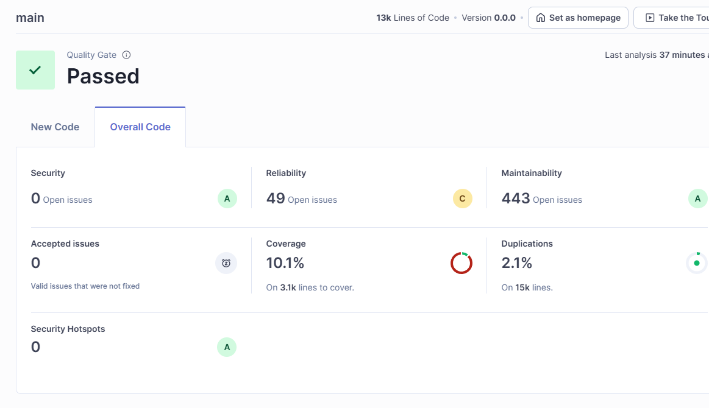
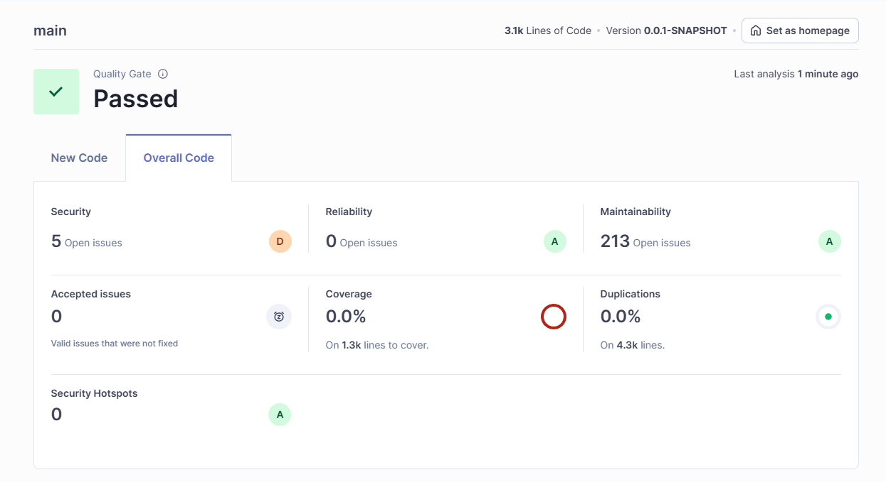

# SideQuest 8A – Testkonzept

> **Datum:** 07.07.2025
> **Projekt:** WISS Forum
> **Analysearten:** Testkonzept für Frontend und Backend
>
> **Teammitglieder & Beiträge**:
>
> - Yanis Sebastian Zürcher: Doku & Umsetzung
> - Hason Bichsel: Recherche
> - Dominik Koenitzer: Recherche

---

## Übersicht

Dieses Testkonzept beschreibt die Teststrategie und Testabdeckung für das WISS Forum Projekt. Es deckt sowohl das Frontend (React, shadcn/ui, Vite, Vitest) als auch das Backend (Spring Boot, JUnit, Mockito, Selenium) ab.

## 1. Frontend

### 1.1 Teststrategie

* **Test-Framework**: Vitest mit jsdom Umgebung
* **Coverage-Tool**: Istanbul (LCOV-Ausgabe)
* **Testarten**:

  * Komponententests
  * Integrationstests (z. B. Kontextverhalten, Authentifizierung)
  * UI-Verhalten 
  * API-Integration
  * Auth-Tests

### 1.2 Schwerpunkte

* **AdminDashboard.tsx** (neues feature von 7A): Deckt die neue Admin-Funktionalität ab mit >80% Coverage
* **contexts/AuthContext.tsx**: Getestet auf Verhalten bei Authentifizierung und Session-Handling
* **lib/utils.ts**: Enthält wichtige Utility-Logik zur Berechnung von Punkten (z. B. für Gamification)
* **lib/api.ts**: Enthält die API-Integration für die Kommunikation mit dem Backend

Sie können die Tests hier finden: [frontend tests](https://github.com/lyfe691/wiss-forum/tree/main/frontend/src/__tests__)


> \[!NOTE]
> Als neues TDD feature have ich das erweiterte `AdminDashboard` erstellt. Das coverage ist über 80% und die Tests sind gut strukturiert.

[AdminDashboard.tsx](./images/admin.png)

### 1.3 Ausnahmen & Herausforderungen

* **shadcn/ui-Komponenten**:

  * Es handelt sich um stabile Open-Source-Komponenten
  * Keine eigenen Modifikationen, daher keine Testabdeckung notwendig

* **Tailwind CSS**:

  * SonarQube meldet Fehler bei Tailwind-At-Rules wie `@plugin`
  * Diese Probleme haben keinen Einfluss auf Laufzeit oder Qualität, wurden daher ignoriert

### 1.4 Technische Details

* **LCOV-Pfad**: `coverage/lcov.info`
* **SonarQube Konfiguration**:

  ```bash
  sonar \
    -Dsonar.host.url=http://localhost:9000 \
    -Dsonar.token=<TOKEN> \
    -Dsonar.projectKey=frontend \
    -Dsonar.javascript.lcov.reportPaths=coverage/lcov.info \
    -Dsonar.exclusions=**/__tests__/**,**/ui/**,**/*.test.tsx,**/*.test.ts \
    -Dsonar.test.inclusions=**/__tests__/**,**/*.test.tsx,**/*.test.ts
  ```

### 1.5 Analyse: Frontend

* Sie finden die Commit History hier: [frontend commit history](https://github.com/lyfe691/wiss-forum/commits/main/frontend)

#### 📸 **SonarQube Frontend Dashboard**


#### **LCOV-Bericht**

```bash
C:\Users\sebiz\Desktop\wiss-forum\frontend>npm run test:coverage

> frontend@0.0.0 test:coverage
> vitest run --coverage


 RUN  v3.2.4 C:/Users/sebiz/Desktop/wiss-forum/frontend
      Coverage enabled with istanbul

 ✓ src/__tests__/types.test.ts (12 tests) 3ms
 ✓ src/__tests__/utils.test.ts (33 tests) 19ms
stdout | src/__tests__/api-normalization.test.ts > API Normalization Functions > AuthAPI normalization > normalizes login response with string role
Sending login request with: { username: 'testuser', isEmail: false }

stdout | src/__tests__/api-normalization.test.ts > API Normalization Functions > AuthAPI normalization > normalizes login response with string role
Raw login response: {}
Processed role: student
Normalized response: {
  token: '',
  id: '',
  username: 'testuser',
  email: '',
  displayName: 'testuser',
  role: 'student',
  avatar: ''
}

stdout | src/__tests__/api.test.ts > API Layer > Error Handling and Real Function Tests > usersAPI.getPublicUserGamificationStats handles empty responses
API: Calling /users/test-user/gamification

stdout | src/__tests__/api-normalization.test.ts > API Normalization Functions > AuthAPI normalization > handles email-based login
Sending login request with: { username: 'test@example.com', isEmail: true }

stdout | src/__tests__/api-normalization.test.ts > API Normalization Functions > AuthAPI normalization > handles email-based login
Raw login response: {}
Processed role: student
Normalized response: {
  token: '',
  id: '',
  username: 'test@example.com',
  email: '',
  displayName: 'test@example.com',
  role: 'student',
  avatar: ''
}

stdout | src/__tests__/api.test.ts > API Layer > Error Handling and Real Function Tests > usersAPI.getPublicUserGamificationStats handles empty responses
API: Response for test-user: []

 ✓ src/__tests__/api.test.ts (12 tests) 11ms
 ✓ src/__tests__/api-normalization.test.ts (54 tests) 12ms
 ✓ src/__tests__/api-functions.test.ts (47 tests) 17ms
stderr | src/__tests__/api-interceptors.test.ts > API Interceptors > Response Interceptor > should handle 404 errors with custom message
Resource not found: /api/test

stderr | src/__tests__/api-interceptors.test.ts > API Interceptors > Response Interceptor > should handle 404 errors with default message
Resource not found: /api/test

 ✓ src/__tests__/api-interceptors.test.ts (18 tests) 307ms
 ✓ src/__tests__/AuthContext.test.tsx (32 tests) 92ms
 ✓ src/__tests__/AdminDashboard.test.tsx (12 tests) 282ms
 ✓ src/__tests__/Login.test.tsx (22 tests) 6190ms
   ✓ Login Component > Form Validation > should not show validation errors when both fields are filled  424ms
   ✓ Login Component > Authentication Flow > should call login function with correct credentials  460ms
   ✓ Login Component > Authentication Flow > should navigate to redirect path after successful login  456ms
   ✓ Login Component > Authentication Flow > should show loading state during login  568ms
   ✓ Login Component > Error Handling > should display generic error for authentication failure  500ms
   ✓ Login Component > Error Handling > should display session expired error for token issues  461ms
   ✓ Login Component > Error Handling > should display server error for server issues  442ms
   ✓ Login Component > Error Handling > should clear error when retrying login  836ms
   ✓ Login Component > Form Interaction > should allow typing in username field  345ms
   ✓ Login Component > Form Interaction > should allow typing in password field  314ms
   ✓ Login Component > Form Interaction > should submit form on Enter key press  440ms

 Test Files  9 passed (9)
      Tests  242 passed (242)
   Start at  05:11:00
   Duration  9.43s (transform 1.34s, setup 1.18s, collect 4.28s, tests 6.93s, environment 4.58s, prepare 1.10s)

 % Coverage report from istanbul
-----------------------------|---------|----------|---------|---------|-------------------------------------------------
File                         | % Stmts | % Branch | % Funcs | % Lines | Uncovered Line #s
-----------------------------|---------|----------|---------|---------|-------------------------------------------------
All files                    |   14.25 |     6.84 |   12.34 |   14.66 |
 src                         |       0 |      100 |       0 |       0 |
  App.tsx                    |       0 |      100 |       0 |       0 | 36
  main.tsx                   |       0 |      100 |     100 |       0 | 6
 src/components              |       0 |        0 |       0 |       0 |
  FileUpload.tsx             |       0 |        0 |       0 |       0 | 31-353
  MarkdownEditor.tsx         |       0 |        0 |       0 |       0 | 51-224
  MarkdownRenderer.tsx       |       0 |        0 |       0 |       0 | 14-33
  NewPostButton.tsx          |       0 |        0 |       0 |       0 | 45-470
  PaginationControls.tsx     |       0 |        0 |       0 |       0 | 26-103
  TextPreview.tsx            |       0 |        0 |       0 |       0 | 15-74
  UserGamificationWidget.tsx |       0 |        0 |       0 |       0 | 48-180
 src/components/auth         |       0 |        0 |       0 |       0 |
  ProtectedRoute.tsx         |       0 |        0 |       0 |       0 | 14-34
 src/components/content      |       0 |        0 |       0 |       0 |
  ContentActions.tsx         |       0 |        0 |       0 |       0 | 56-278
 src/components/layout       |       0 |        0 |       0 |       0 |
  AuthLayout.tsx             |       0 |      100 |       0 |       0 | 6
  Footer.tsx                 |       0 |        0 |       0 |       0 | 7-225
  MainLayout.tsx             |       0 |        0 |       0 |       0 | 11-32
  Navbar.tsx                 |       0 |        0 |       0 |       0 | 33-153
  SideNav.tsx                |       0 |        0 |       0 |       0 | 25-375
 src/components/ui           |   12.22 |     7.87 |    9.15 |    12.4 |
  RouterLink.tsx             |       0 |      100 |       0 |       0 | 10-24
  accordion.tsx              |       0 |      100 |       0 |       0 | 10-53
  alert-dialog.tsx           |       0 |      100 |       0 |       0 | 12-137
  alert.tsx                  |      75 |      100 |   66.66 |      75 | 39
  aspect-ratio.tsx           |       0 |      100 |       0 |       0 | 6
  avatar.tsx                 |     100 |      100 |     100 |     100 |
  badge.tsx                  |     100 |    66.66 |     100 |     100 | 35
  breadcrumb.tsx             |       0 |        0 |       0 |       0 | 8-87
  button.tsx                 |     100 |       50 |     100 |     100 | 98,112-125
  calendar.tsx               |       0 |        0 |       0 |       0 | 14-63
  card.tsx                   |   85.71 |      100 |   85.71 |   85.71 | 52
  carousel.tsx               |       0 |        0 |       0 |       0 | 33-212
  chart.tsx                  |   26.31 |     7.84 |   41.66 |   26.31 | 26-32,76,127-185,262-339
  checkbox.tsx               |       0 |      100 |       0 |       0 | 13
  collapsible.tsx            |       0 |      100 |       0 |       0 | 6-23
  command.tsx                |       0 |        0 |       0 |       0 | 20-155
  context-menu.tsx           |       0 |        0 |       0 |       0 | 12-224
  dialog.tsx                 |       0 |      100 |       0 |       0 | 10-120
  drawer.tsx                 |       0 |      100 |       0 |       0 | 9-110
  dropdown-menu.tsx          |       0 |        0 |       0 |       0 | 12-231
  form.tsx                   |   89.28 |       80 |   85.71 |   89.28 | 51,124-126
  hover-card.tsx             |       0 |        0 |       0 |       0 | 9-26
  input-otp.tsx              |       0 |        0 |       0 |       0 | 16-70
  input.tsx                  |     100 |      100 |     100 |     100 |
  label.tsx                  |     100 |      100 |     100 |     100 |
  menubar.tsx                |       0 |        0 |       0 |       0 | 11-245
  navigation-menu.tsx        |       0 |        0 |       0 |       0 | 16-144
  pagination.tsx             |       0 |        0 |       0 |       0 | 12-106
  popover.tsx                |       0 |        0 |       0 |       0 | 11-48
  progress.tsx               |       0 |        0 |       0 |       0 | 13
  radio-group.tsx            |       0 |      100 |       0 |       0 | 13-26
  resizable.tsx              |       0 |        0 |       0 |       0 | 11-36
  scroll-area.tsx            |       0 |        0 |       0 |       0 | 13-36
  select.tsx                 |       0 |        0 |       0 |       0 | 10-158
  separator.tsx              |       0 |        0 |       0 |       0 | 14
  sheet.tsx                  |       0 |        0 |       0 |       0 | 8-128
  sidebar.tsx                |       0 |        0 |       0 |       0 | 28-682
  skeleton.tsx               |     100 |      100 |     100 |     100 |
  slider.tsx                 |       0 |        0 |       0 |       0 | 16-53
  sonner.tsx                 |       0 |        0 |       0 |       0 | 4-7
  switch.tsx                 |       0 |      100 |       0 |       0 | 12
  table.tsx                  |       0 |      100 |       0 |       0 | 6-96
  tabs.tsx                   |       0 |      100 |       0 |       0 | 10-55
  textarea.tsx               |       0 |      100 |       0 |       0 | 6
  toast.tsx                  |       0 |      100 |       0 |       0 | 8-111
  toaster.tsx                |       0 |        0 |       0 |       0 | 14-19
  toggle-group.tsx           |       0 |        0 |       0 |       0 | 10-53
  toggle.tsx                 |       0 |      100 |       0 |       0 | 7-36
  tooltip.tsx                |       0 |        0 |       0 |       0 | 10-44
  use-toast.ts               |       0 |        0 |       0 |       0 | 6-185
 src/contexts                |   81.06 |    61.03 |   56.25 |   81.53 |
  AuthContext.tsx            |   98.16 |    64.38 |     100 |   98.14 | 37-38
  ThemeContext.tsx           |       0 |        0 |       0 |       0 | 10-56
 src/hooks                   |       0 |      100 |       0 |       0 |
  use-mobile.ts              |       0 |      100 |       0 |       0 | 3-18
 src/lib                     |   53.19 |    17.88 |   66.25 |   55.23 |
  api.ts                     |   56.39 |    13.58 |   71.18 |   58.61 | ...,654,665-666,675,680,701-710,750-765,793-878
  permissions.ts             |       0 |        0 |       0 |       0 | 25-88
  theme.ts                   |       0 |        0 |       0 |       0 | 8-79
  types.ts                   |     100 |      100 |     100 |     100 |
  utils.ts                   |    90.9 |    83.33 |     100 |    90.9 | 70-71
 src/pages                   |       0 |        0 |       0 |       0 |
  AdminTool.tsx              |       0 |        0 |       0 |       0 | 16-204
  Help.tsx                   |       0 |      100 |       0 |       0 | 35
  Home.tsx                   |       0 |        0 |       0 |       0 | 38-303
  Leaderboard.tsx            |       0 |        0 |       0 |       0 | 57-248
  NotFound.tsx               |       0 |      100 |       0 |       0 | 6
  Privacy.tsx                |       0 |      100 |       0 |       0 | 31-34
  Profile.tsx                |       0 |        0 |       0 |       0 | 81-848
  Settings.tsx               |       0 |        0 |       0 |       0 | 48-620
  Terms.tsx                  |       0 |      100 |       0 |       0 | 29-32
 src/pages/admin             |    7.95 |     10.5 |   11.53 |       8 |
  AdminDashboard.tsx         |   83.87 |    83.33 |      60 |   83.87 | 107,137,192-320
  CategoryManagement.tsx     |       0 |        0 |       0 |       0 | 73-670
  UserManagement.tsx         |       0 |        0 |       0 |       0 | 72-428
 src/pages/auth              |      25 |    23.63 |   20.68 |   25.22 |
  ForgotPassword.tsx         |       0 |        0 |       0 |       0 | 15-117
  Login.tsx                  |     100 |    81.25 |     100 |     100 | 30,60
  Register.tsx               |       0 |        0 |       0 |       0 | 15-203
  ResetPassword.tsx          |       0 |        0 |       0 |       0 | 15-161
 src/pages/categories        |       0 |        0 |       0 |       0 |
  Categories.tsx             |       0 |        0 |       0 |       0 | 35-265
  CategoryDetail.tsx         |       0 |        0 |       0 |       0 | 78-518
 src/pages/topics            |       0 |        0 |       0 |       0 |
  CreateTopic.tsx            |       0 |        0 |       0 |       0 | 29-373
  LatestTopics.tsx           |       0 |        0 |       0 |       0 | 73-358
  TopicDetail.tsx            |       0 |        0 |       0 |       0 | 91-1222
 src/pages/users             |       0 |        0 |       0 |       0 |
  UserProfile.tsx            |       0 |        0 |       0 |       0 | 39-97
  Users.tsx                  |       0 |        0 |       0 |       0 | 37-149
-----------------------------|---------|----------|---------|---------|-------------------------------------------------


```

Reliability war auch nicht möglich da fast alle issues mit shadcn/ui zusammenhängen.

---

## 2. Backend

### 2.1 Teststrategie

* **Test-Frameworks**: JUnit 5, Mockito, Selenium
* **Testarten**:

  * Unit-Tests mit Mockito (@Mock, @Spy)
  * Integrationstests mit realen Datenbankverbindungen
  * End-to-End Tests mit Selenium (UI & Login-Flows)

### 2.2 Schwerpunkte

* **Mockito**: Für Services wie Bewertung, Punktevergabe, Authentifizierung
* **AdminAccessTest (Selenium)**:

  * Testet den gesamten Admin-Zugriffs-Flow:

    * Registrierung
    * Login
    * Rollenänderung
    * Zugriff auf /admin/dashboard

### 2.3 Besonderheiten

* **Selenium-Tests** wurden nachträglich wiederhergestellt (ursprünglich entfernt)
* **Testziel** war es, gezielt die Admin-Erweiterung funktional zu validieren

> \[!NOTE]
> Der Selenium-Test simuliert realistische Interaktionen im Forum – z. B. die Erstellung eines Admins, Vergabe der Rolle und Zugriff auf Adminfunktionen.

### 2.4 Technische Details

* **Ausführung**: `mvn -Dtest=AdminAccessTest test`
* **SonarQube Konfiguration** über `sonar-project.properties`
* Fokus auf Java-Code – keine Tailwind/JS-Relevanz im Backend

### 2.5 Analyse: Backend

* Sie finden die Commit History hier: [backend commit history](https://github.com/lyfe691/wiss-forum/commits/main/backend)

#### 📸 **SonarQube Backend Dashboard**


#### **mvn-Testlauf mit AdminAccessTest** (neues feature, neuer test)
```bash
cd backend
mvn -Dtest=AdminAccessTest test
```

```bash
[INFO] -------------------------------------------------------
[INFO]  T E S T S
[INFO] -------------------------------------------------------
[INFO] Running ch.wiss.forum.selenium.tests.AdminAccessTest
05:13:29.241 [main] INFO io.github.bonigarcia.wdm.WebDriverManager -- Using chromedriver 138.0.7204.92 (resolved driver for Chrome 138)
05:13:29.263 [main] INFO io.github.bonigarcia.wdm.WebDriverManager -- Exporting webdriver.chrome.driver as C:\Users\sebiz\.cache\selenium\chromedriver\win64\138.0.7204.92\chromedriver.exe
Jul 07, 2025 5:13:29 AM org.openqa.selenium.devtools.CdpVersionFinder findNearestMatch
WARNING: Unable to find CDP implementation matching 138
Jul 07, 2025 5:13:29 AM org.openqa.selenium.chromium.ChromiumDriver lambda$new$5
WARNING: Unable to find version of CDP to use for 138.0.7204.97. You may need to include a dependency on a specific version of the CDP using something similar to `org.seleniumhq.selenium:selenium-devtools-v86:4.25.0` where the version ("v86") matches the version of the chromium-based browser you're using and the version number of the artifact is the same as Selenium's.
Starting test: ? Promote to Admin and Access Dashboard with browser: CHROME
Checking registration success...
Current URL after registration: http://localhost:3000/
? Success: Redirected away from register page
Admin tool page loaded - URL: http://localhost:3000/admin-tool
Page title: WISS Forum
? Admin Role Manager found on page
Starting admin promotion...
Current user ID from form: 686b3b5baa6c030f604a12fd
? User ID populated: 686b3b5baa6c030f604a12fd
? Secret key pre-filled correctly
Original URL: http://localhost:3000/admin-tool
? Clicked submit button
Phase 1 - Check 1 for success message
? Success alert found: success
user has been made a admin successfully! please log back in for the changes to apply. logging out...
Phase 2 - Waiting for auto-logout...
Phase 2 - Check 1 - URL: http://localhost:3000/admin-tool
Phase 2 - Check 2 - URL: http://localhost:3000/admin-tool
Phase 2 - Check 3 - URL: http://localhost:3000/admin-tool
Phase 2 - Check 4 - URL: http://localhost:3000/login
? Auto-logout successful - redirected to login
? Admin Dashboard rendered successfully for promoted user.
Finished test: ? Promote to Admin and Access Dashboard
[INFO] Tests run: 1, Failures: 0, Errors: 0, Skipped: 0, Time elapsed: 42.05 s -- in ch.wiss.forum.selenium.tests.AdminAccessTest
[INFO]
[INFO] Results:
[INFO]
[INFO] Tests run: 1, Failures: 0, Errors: 0, Skipped: 0
[INFO]
[INFO] ------------------------------------------------------------------------
[INFO] BUILD SUCCESS
[INFO] ------------------------------------------------------------------------
[INFO] Total time:  44.049 s
[INFO] Finished at: 2025-07-07T05:14:11+02:00
[INFO] ------------------------------------------------------------------------

```


---

## 3. Bewertung

* **Frontend Coverage**: Rund 10%, gezielt auf Custom Logic und kritische Komponenten, 80% Coverage ist beinahe unmöglich aufgrund der vielen shadcn/ui Komponenten.
* **Backend Coverage**: Admin-Flow und wichtige Logik mit hoher Qualität getestet


---

## 4. Fazit

**Testquellen:**  
– [Frontend Tests](https://github.com/lyfe691/wiss-forum/tree/main/frontend/src/__tests__)  
– [Backend Tests](https://github.com/lyfe691/wiss-forum/blob/main/backend/src/test/java/ch/wiss/forum/)

Die Umsetzung des Testkonzepts stellte aufgrund der Projektgrösse und der gewählten Architektur gewisse Herausforderungen dar. Das WISS Forum ist ein umfangreiches Projekt mit vielen Seiten, Rollen und UI-Komponenten. Besonders im Frontend war es schwierig, eine hohe Testabdeckung zu erreichen, da ein grosser Teil der Oberfläche auf generischen Komponenten aus dem shadcn/ui-Framework basiert. Diese Komponenten sind stabil, gut getestet und wurden bewusst nicht verändert, weshalb deren Einbindung in das Coverage-Target keine sinnvolle Aussagekraft gehabt hätte.

Zudem mussten während der Entwicklung technische Kompromisse eingegangen werden, um die Applikation funktional, wartbar und testbar zu halten. Dies betrifft etwa komplexe Tailwind-At-Rules, dynamisches Rendering sowie Authentifizierungsflüsse, die sowohl im Frontend als auch im Backend separat validiert wurden.

Trotz dieser Einschränkungen wurde TDD konsequent angewendet, und es konnte in den eigenen Logikbereichen eine qualitativ hochwertige, gezielte Testabdeckung erreicht werden. Die wichtigsten Features wie die Admin-Funktionalität, Rollenlogik, Punktevergabe und Zugriffsschutz sind vollständig durch automatisierte Tests abgedeckt.
